# Actividad 1 - Despliegue de Flarum en AWS

## Descripción

En esta actividad se despliega una aplicación web basada en Flarum sobre una instancia EC2 en AWS, 
cumpliendo con los requisitos de infraestructura, almacenamiento y configuración del servidor web.

---

## Arquitectura

- Instancia EC2 (Amazon Linux 2023)
- Volumen EBS adicional (5 GiB)
- Servidor web Apache
- PHP 8+
- Composer
- Flarum (framework de foro)

---

## Paso 1: Creación de la instancia EC2

Se crea una instancia EC2 con las siguientes características:

- Tipo: t3.small
- Sistema operativo: Amazon Linux 2023
- Volumen raíz: 10 GiB

 **Evidencias:**
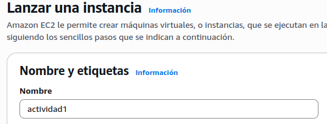
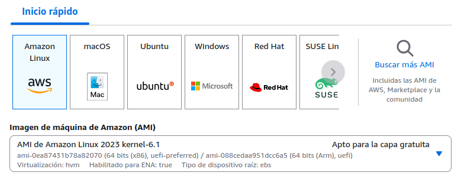
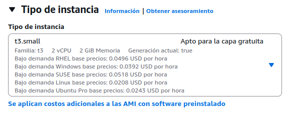

---

## Acceso y configuración inicial

Se genera una clave PEM para conexión SSH y se configura acceso restringido por IP.

 **Evidencias:**
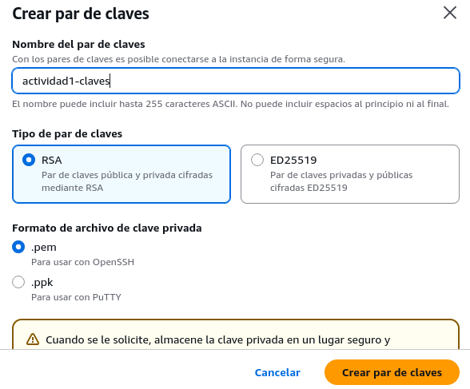
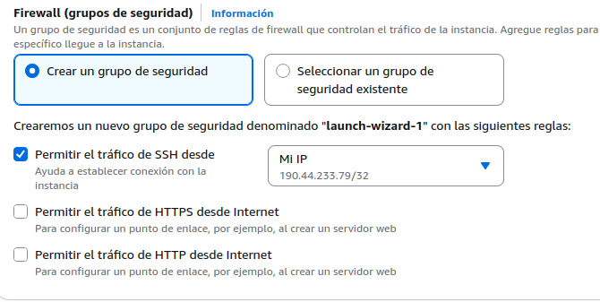

---

## Configuración de almacenamiento

Se añade un volumen EBS de 5 GiB y se monta en la instancia.

 **Evidencias:**
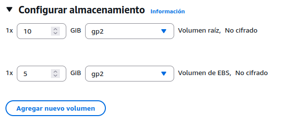
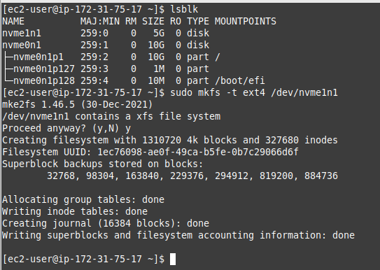

---

## Conexión a la instancia

Se realiza conexión vía SSH desde terminal Linux.

 **Evidencias:**
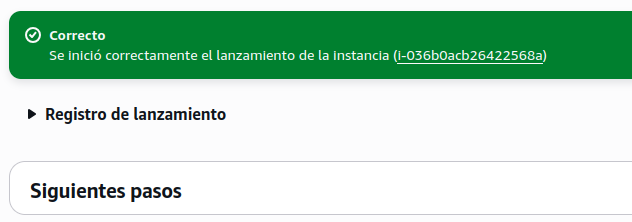
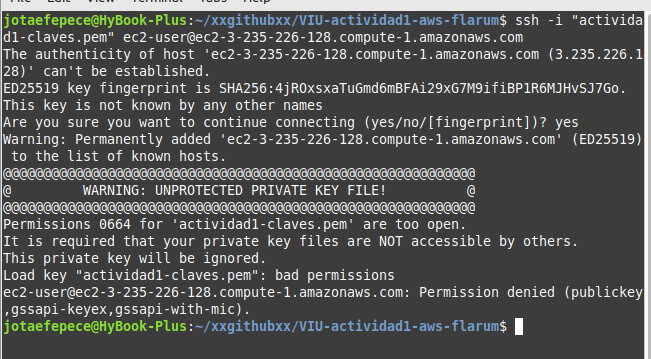

---

## Preparación del entorno

Se crea la estructura de directorios en el volumen EBS:

- `/mnt/sdb/www`

 **Evidencias:**
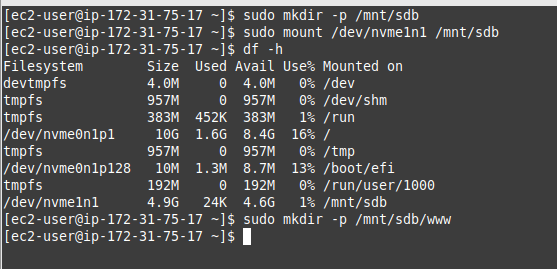

---

## Instalación y configuración de Apache

Se instala Apache y se configura para ejecutarse automáticamente.

 **Evidencias:**
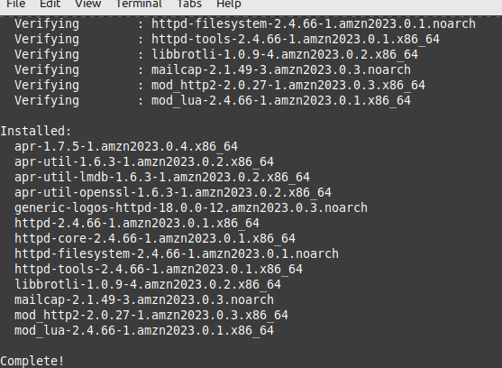
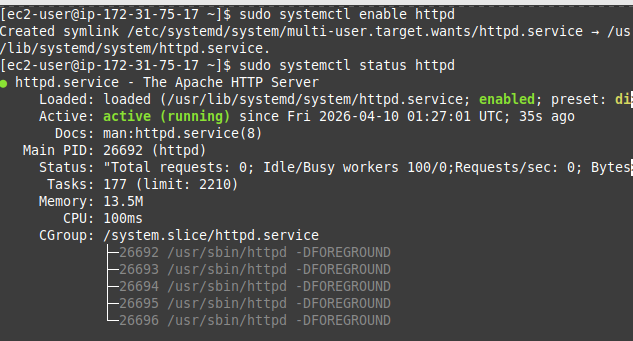

---

## Configuración del VirtualHost

Se configura Apache para escuchar en el puerto 80.

 **Evidencias:**
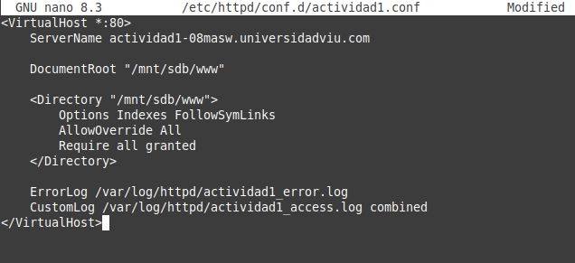

---

## Prueba del servidor web

Se verifica el funcionamiento del servidor Apache.

 **Evidencias:**
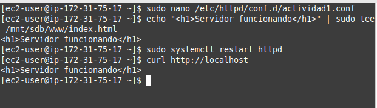

---

## Instalación de PHP

Se instala PHP y se valida su funcionamiento.

 **Evidencias:**
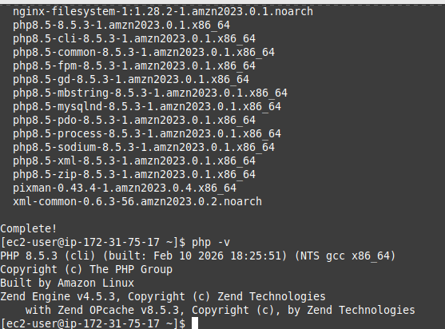
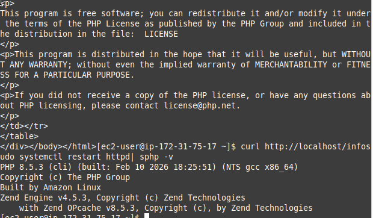

---

## Instalación de Composer

Se instala Composer para gestión de dependencias.

 **Evidencias:**
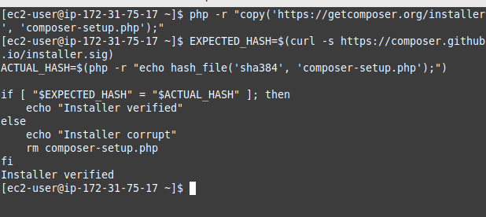
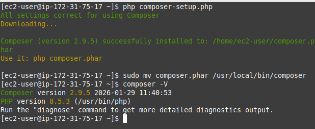

---

## Preparación del entorno para Flarum

Se limpia el directorio de instalación y se instalan dependencias necesarias (git).

 **Evidencias:**
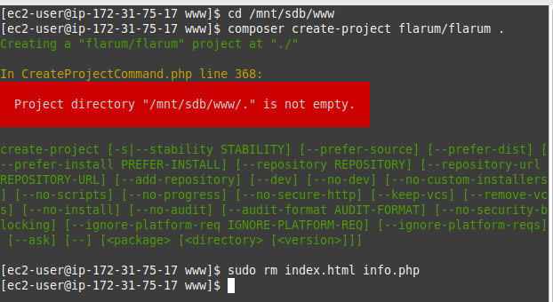
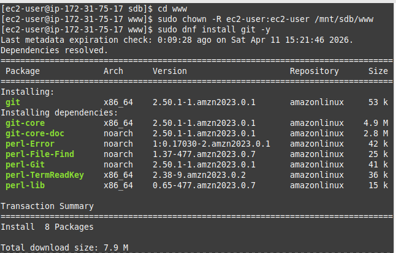

---

## Instalación de Flarum

Se instala Flarum mediante Composer en `/mnt/sdb/www`.

 **Evidencias:**
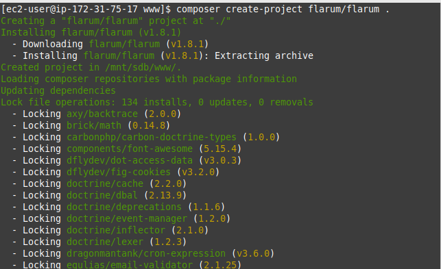

---

## Configuración final de Apache

Se ajusta el VirtualHost para apuntar a `/public`.

 **Evidencias:**
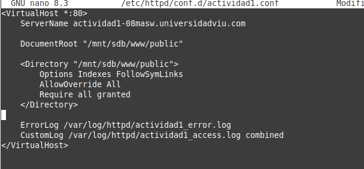

---

## Verificación final

Se comprueba que Flarum carga correctamente mostrando el asistente de instalación.

 **Evidencias:**
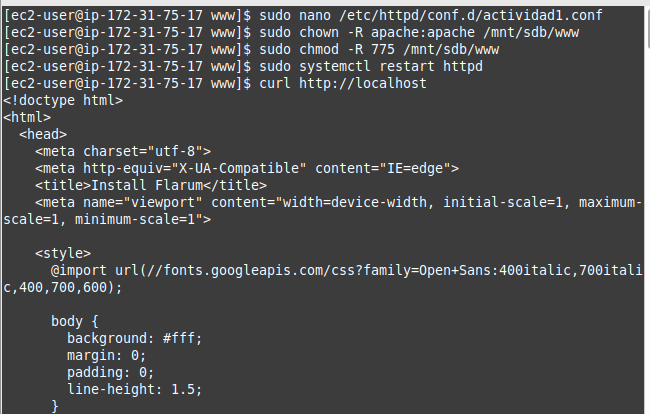

---

## Incidencias encontradas

### 1. Volumen no montado tras reinicio
Se solucionó montando manualmente el volumen EBS.

### 2. Problemas de permisos
Se corrigieron asignando permisos al usuario `apache`.

### 3. Dependencias faltantes
Se instaló `git` para permitir la descarga de paquetes.

---

## Estado final

- Infraestructura desplegada  
- Servidor web operativo  
- Aplicación Flarum instalada  

Pendiente:
- Configuración de base de datos (Tarea 4 - RDS)

---

## Conclusiones

La actividad permitió comprender el proceso completo de despliegue de una aplicación web en AWS, incluyendo:

- Gestión de instancias EC2
- Uso de volúmenes EBS
- Configuración de servidor Apache
- Instalación de aplicaciones modernas con Composer

---

## Volver al índice general

Acceder al README principal de la actividad1 desde aquí:

👉 [Volver al README](../README.md)

