# Tarea 2: Configuración de Security Group en EC2

## Objetivo

Configurar un grupo de seguridad para una instancia EC2 cumpliendo las siguientes condiciones:

1.  Acceso SSH solo para IP personal.
2.  Puertos HTTP (80) y HTTPS (443) abiertos al público.
3.  Bloqueo del resto de puertos de entrada.
4.  Permitir todo el tráfico de salida.

---

## Creación y configuración inicial

Durante la creación de la instancia EC2 se configuró correctamente el Security 
Group desde el inicio.


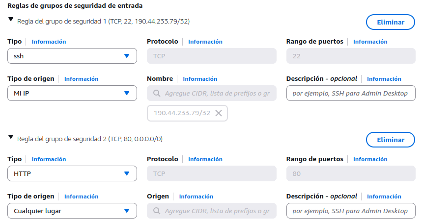

### Reglas configuradas:

| Tipo | Puerto | Origen |
| :--- | :--- | :--- |
| SSH | 22 | IP personal (/32) |
| SSH | 22 | 83.138.41.161/32 |
| HTTP | 80 | 0.0.0.0/0 |
| HTTPS | 443 | 0.0.0.0/0 |

- [x] El resto de puertos quedan bloqueados por defecto.
- [x] Tráfico de salida permitido completamente (default AWS).

---

##  Validación de servicios

### 🔸 HTTP funcionando

Evidencias:

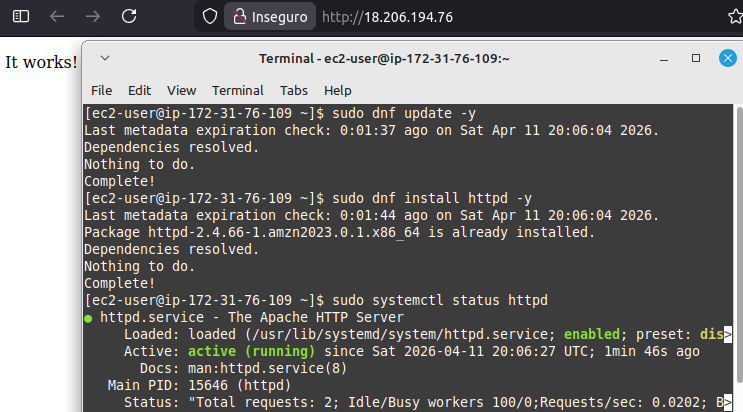

Evidencias:

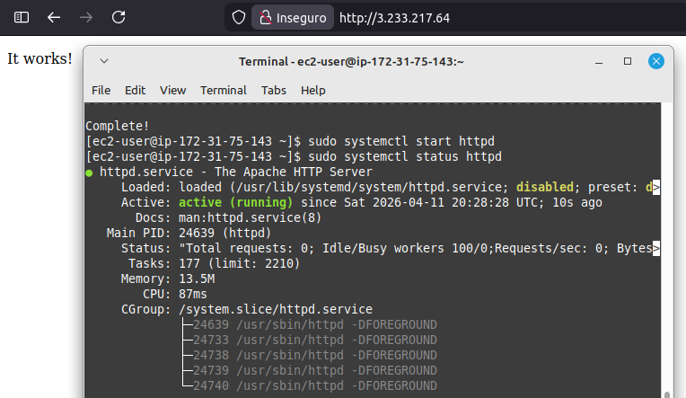

- [x] Apache responde correctamente en puerto 80.

---

### 🔸 HTTPS funcionando

Evidencias:

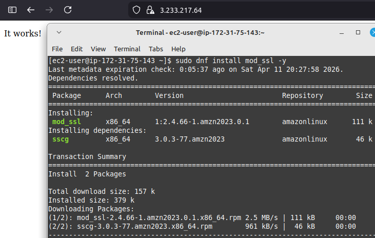

Se habilitó SSL mediante:

```bash
sudo dnf install mod_ssl -y
sudo systemctl restart httpd
```

- [x] El puerto 443 queda accesible.
- [x] Se valida conexión segura (aunque sin certificado válido).

---

### 🔸 SSH funcionando

Evidencias:

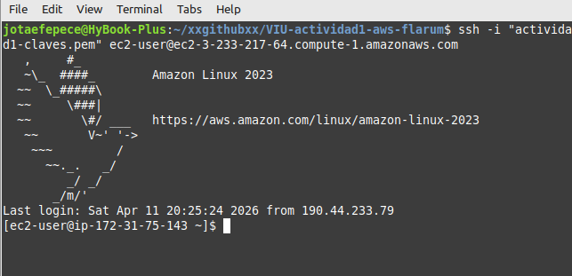

- [x] Acceso permitido solo desde IP autorizada.
- [x] Restricción funcionando correctamente.

---

##  Integración con Tarea 1

Se aprovechó esta instancia para completar correctamente la Tarea 1:

### Montaje de volumen EBS

Evidencias:

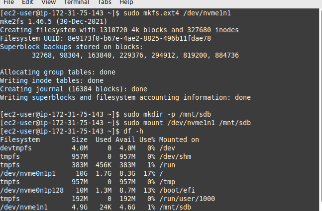

Evidencias:

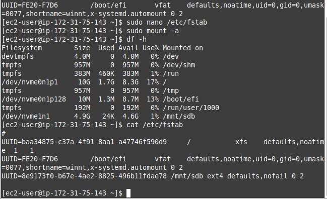

Configuración en `/etc/fstab`:
```text
UUID=8e9173f0-b67e-4ae2-8825-496b11fdae78 /mnt/sdb ext4 defaults,nofail 0 2
```

- [x] Montaje persistente tras reinicio.
- [x] Volumen disponible en `/mnt/sdb`.

### Instalación de PHP y Composer

Evidencias:

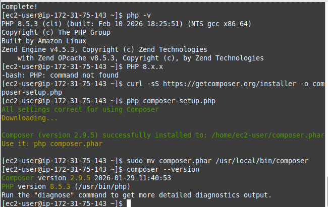

```bash
sudo dnf install php php-cli php-fpm php-mysqlnd php-json php-mbstring php-xml php-curl php-zip -y
sudo dnf install php-gd -y
```

Instalación de Composer:
```bash
curl -sS https://getcomposer.org/installer -o composer-setup.php
php composer-setup.php
sudo mv composer.phar /usr/local/bin/composer
```

### Instalación de Flarum

Evidencias:

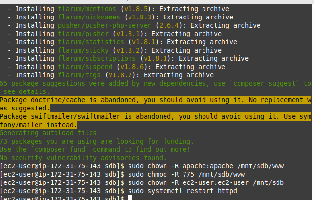

```bash
sudo composer create-project flarum/flarum /mnt/sdb/www
```

Permisos:
```bash
sudo chown -R apache:apache /mnt/sdb/www
sudo chmod -R 775 /mnt/sdb/www
```

### Validación en navegador

Evidencias:

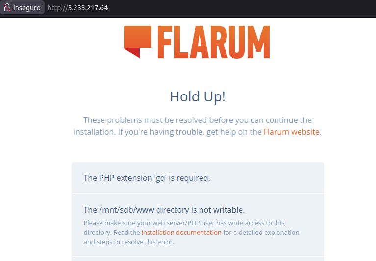

- [x] Aplicación accesible vía IP pública.
- [x] Instalador de Flarum visible.

### Corrección de dependencias y permisos

Evidencias:

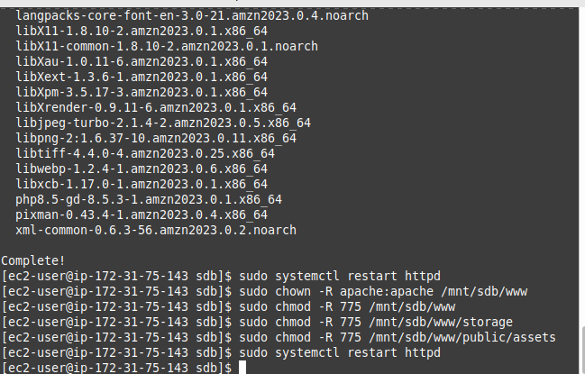

```bash
sudo chmod -R 775 /mnt/sdb/www/storage
sudo chmod -R 775 /mnt/sdb/www/public/assets
```

- [x] Eliminación de errores de escritura.
- [x] Extensión PHP gd instalada.

### Simulación de dominio local

Evidencias:

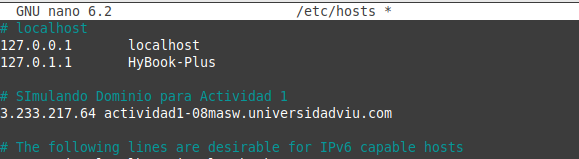

Edición de `/etc/hosts`:
```text
3.233.217.64 actividad1-08masw.universidadviu.com
```

Evidencias:

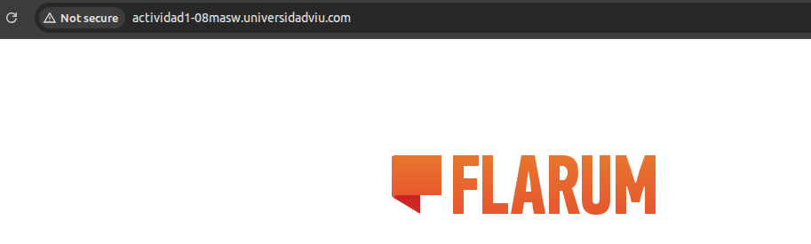

- [x] Dominio resuelve correctamente en entorno local.
- [x] Acceso funcional vía HTTP.

---

## Problemas encontrados y soluciones

| Problema | Solución |
| :--- | :--- |
| HTTP no respondía | Se agregó regla desde creación de instancia |
| Volumen no persistente | Configuración en `/etc/fstab` |
| Composer sin permisos | Uso de `sudo` |
| PHP faltante | Instalación completa de paquetes |
| Error en Flarum (gd) | Instalación `php-gd` |
| Permisos incorrectos | Ajuste con `chown` y `chmod` |
| HTTPS no disponible | Instalación de `mod_ssl` |

---

## Comandos principales utilizados

```bash
# Actualización e instalación de Apache
sudo dnf update -y
sudo dnf install httpd -y
sudo systemctl start httpd

# Habilitación de SSL
sudo dnf install mod_ssl -y
sudo systemctl restart httpd

# Formateo y montaje de volumen EBS
sudo mkfs.ext4 /dev/nvme1n1
sudo mount /dev/nvme1n1 /mnt/sdb

# Persistencia en fstab
sudo nano /etc/fstab
sudo mount -a

# Instalación de PHP y Composer
sudo dnf install php php-cli php-fpm php-mysqlnd php-json php-mbstring php-xml php-curl php-zip -y
sudo dnf install php-gd -y

curl -sS https://getcomposer.org/installer -o composer-setup.php
php composer-setup.php
sudo mv composer.phar /usr/local/bin/composer

# Despliegue de Flarum
sudo composer create-project flarum/flarum /mnt/sdb/www
sudo chown -R apache:apache /mnt/sdb/www
sudo chmod -R 775 /mnt/sdb/www
```

---

## Conclusión

Se configuró correctamente el Security Group cumpliendo los requisitos:
- [x] Acceso SSH restringido.
- [x] HTTP y HTTPS accesibles públicamente.
- [x] Puertos innecesarios bloqueados.
- [x] Tráfico saliente permitido.

Además, se logró desplegar la aplicación Flarum integrada 
con la configuración de almacenamiento y servidor web.

---

## Volver al índice general

Acceder al README principal de la actividad1 desde aquí:

🔙 [Volver al README](../README.md)

