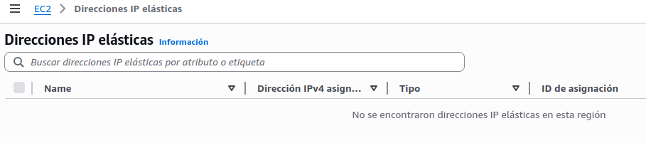
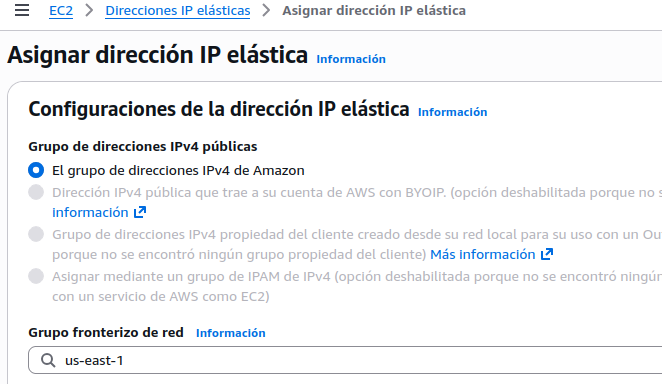
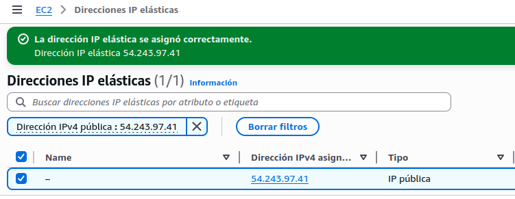
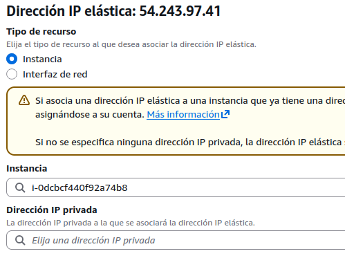
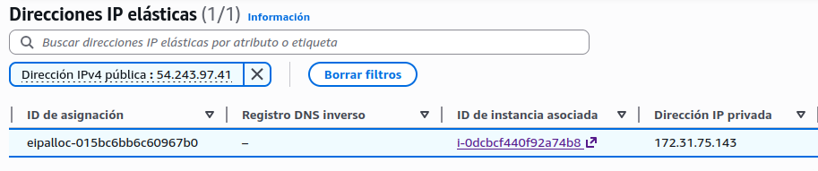
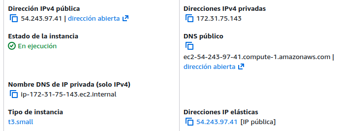
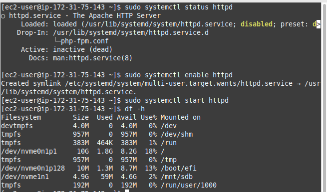
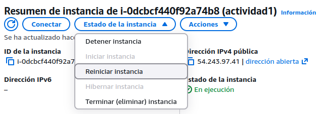
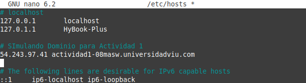

#  Tarea 3: Asociación de Elastic IP en EC2

## Objetivo

Asignar una dirección IP elástica a la instancia EC2 para evitar que la 
IP pública cambie tras reinicios, garantizando un acceso estable al servidor web.

---

## Creación de la Elastic IP

Se accede al servicio EC2 → sección **Elastic IPs**.

Evidencias:



---

## Asignación de nueva IP elástica

Se selecciona la opción por defecto de grupo fronterizo asignado.

Evidencias:



- [x] Se mantiene la configuración por defecto.

---

Evidencias:



- [x] Dirección IP elástica creada correctamente.

---

## Asociación a la instancia EC2

Se asocia la IP a la instancia en ejecución:

Evidencias:



---

Evidencias:



- [x] IP elástica vinculada correctamente.
- [x] La IP pública anterior deja de estar disponible.

---

## Validación de acceso

Se accede a la aplicación mediante la nueva IP:

Evidencias:


- [x] Aplicación Flarum accesible correctamente.
- [x] Servidor web funcionando sin cambios adicionales.

---

Evidencias:



- [x] Confirmación desde interfaz de acceso a AWS, la IP activa.

---

## Persistencia tras reinicio

Se asegura que los servicios se mantengan tras reinicio.

Evidencias:



```bash
sudo systemctl enable httpd
```
- [x] Apache configurado para iniciar automáticamente.

Evidencias:



Se reinicia la instancia desde AWS para validar comportamiento.

Evidencias:


- [x] La IP elástica se mantiene.
- [x] El servicio web sigue operativo.
- [x] No se requieren reconfiguraciones adicionales.

---

## Simulación de dominio

Se configura resolución local mediante archivo `/etc/hosts`.

Evidencias:



```text
<IP_ELASTICA> actividad1-08masw.universidadviu.com
```

Evidencias:


- [x] Dominio resuelto correctamente.
- [x] Acceso funcional mediante nombre de dominio.

---

## Consideraciones importantes

- Una Elastic IP permanece fija incluso tras reinicios.
- La IP pública anterior se pierde al asociar una Elastic IP.
- AWS puede generar costes si la IP no está asociada a una instancia activa.

---

## Conclusión

Se ha configurado correctamente una dirección IP elástica:
- [x] Acceso estable al servidor web.
- [x] Persistencia tras reinicio de la instancia.
- [x] Integración completa con la aplicación desplegada.

---

## Volver al índice general

Acceder al README principal de la actividad1 desde aquí:

🔙 [Volver al README](../README.md)
