# Tarea 4 - Base de Datos RDS (MySQL)

## Objetivo

Desplegar una base de datos en **Amazon RDS** (MySQL 5.x) para almacenar 
la información de la aplicación Flarum, garantizando seguridad, conectividad y 
persistencia de datos.

---

## Creación de la base de datos

Se accede al servicio **RDS** desde la consola de AWS.

Evidencia
 
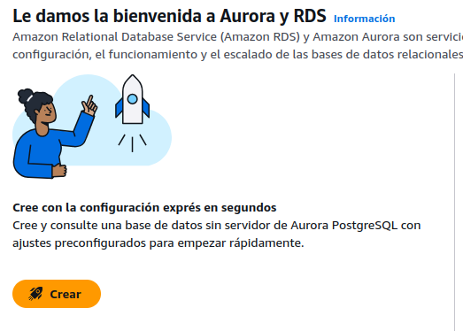

Se ingresa a la opción de creación de base de datos.

Evidencia
 
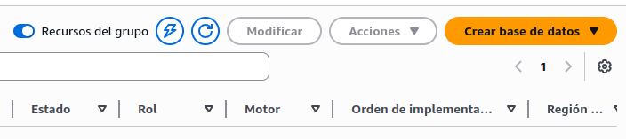

Se selecciona el motor **MySQL** requerido por la actividad.

Evidencia
 
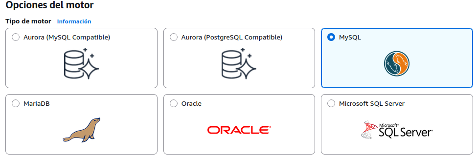

Se configuran las credenciales de acceso para el usuario administrador.

Evidencia
 
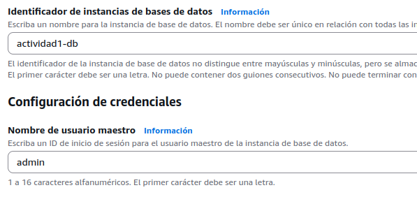

Finalmente, se crea la base de datos correctamente.

Evidencia
  
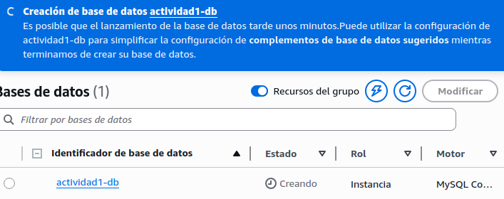

---

## Preparación de la instancia EC2

Se instala el cliente **MariaDB** para permitir la conexión desde la instancia EC2 hacia el endpoint de RDS.

Evidencia
 
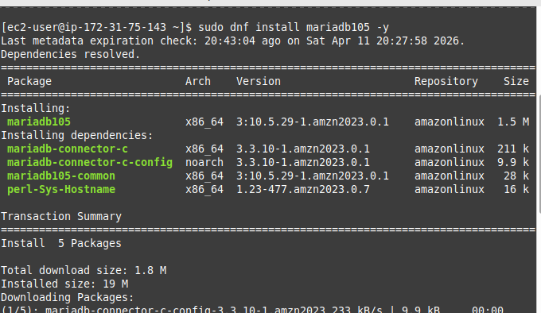

```bash
sudo dnf install mariadb105 -y
```

---

## Configuración de seguridad

Se accede a la edición de las reglas de entrada del **Security Group** de la base de datos.

Evidencia
 
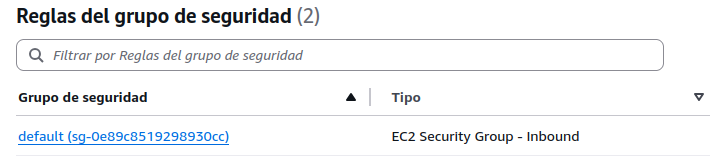

Se habilita el puerto **3306** para MySQL.

Evidencia
 
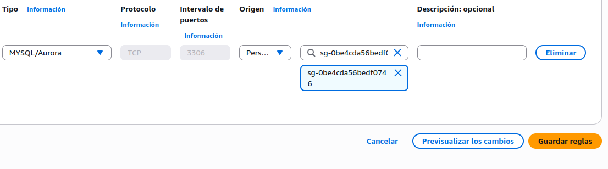

Se permite el acceso desde la instancia EC2 (seleccionando su Security Group previo).

Evidencia
 
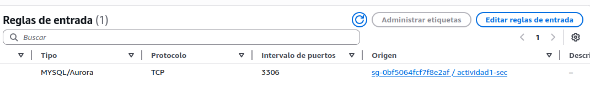

---

## Conexión a la base de datos

Se realiza la conexión desde la instancia EC2 usando el cliente MySQL y el endpoint proporcionado por RDS.

Evidencia
 
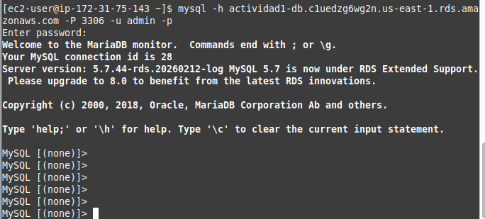

---

## Creación de base de datos y usuario

Se crea la base de datos y el usuario específico con los permisos necesarios para el funcionamiento de Flarum.

Evidencia
 
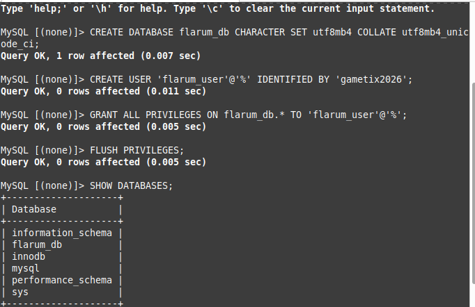

---

## Integración con Flarum

Se ingresan los datos de conexión (Host, Database, User, Password) en el instalador web de Flarum, logrando desplegar la aplicación correctamente.

Evidencia
 
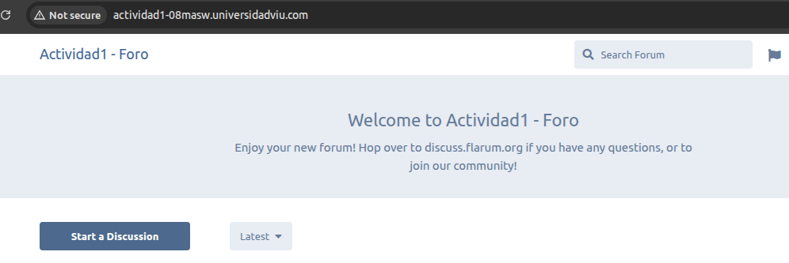

- Aplicación conectada exitosamente a RDS.

---

## Verificación del funcionamiento

Se realiza un post de prueba dentro del foro para validar la escritura en la base de datos.

Evidencia
 
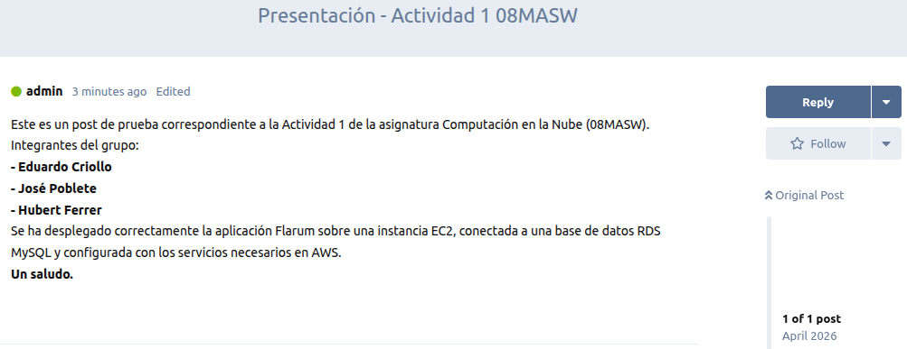

---

## Acceso adicional para administración

Se añade una regla de entrada adicional para permitir el acceso directo a la base de datos desde la IP del administrador (gestión remota).

Evidencia
 
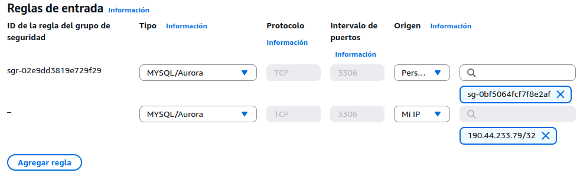

---

## Configuración de backups

Se configuran las copias de seguridad automáticas con un periodo de retención de **10 días**.

Evidencia
  
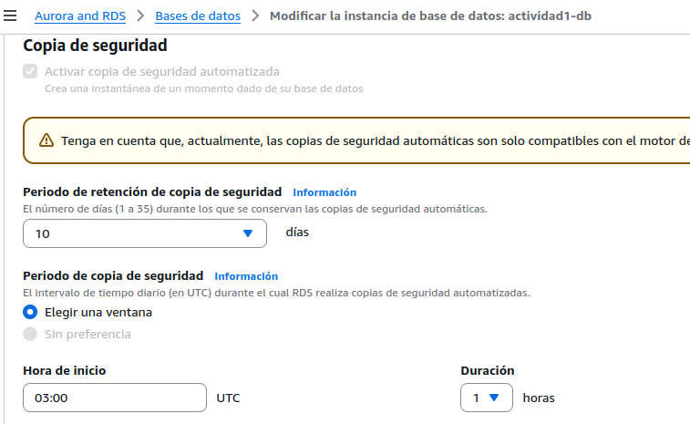

---

## Configuración de mantenimiento

Se define la ventana de mantenimiento programado para asegurar la estabilidad del servicio.

Evidencia
 
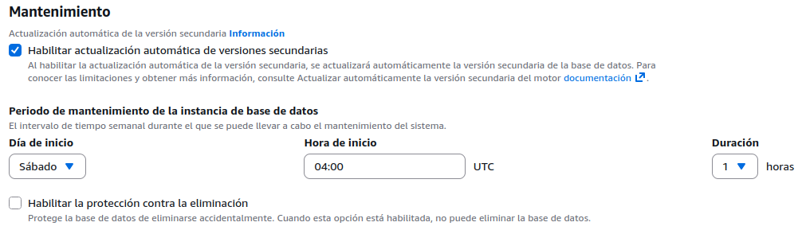

---

## Resumen de configuración

Se visualiza el resumen de todas las configuraciones aplicadas a la instancia de base de datos antes de finalizar.

Evidencia
 
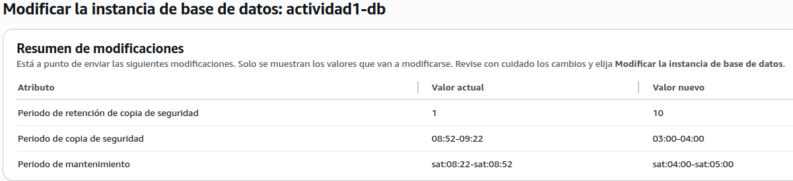

---

## Resultado final

La aplicación Flarum se encuentra completamente operativa y conectada a la base de datos RDS, con todas las políticas de seguridad y mantenimiento activas.

Evidencia
 
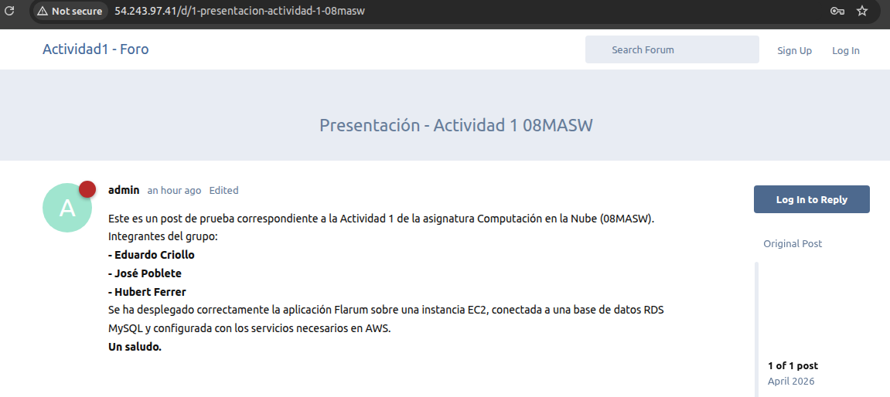

---

## Conclusión

Se ha implementado correctamente la base de datos en Amazon RDS cumpliendo todos los requisitos de la actividad:
- [x] Motor MySQL 5.x.
- [x] Acceso restringido mediante Security Groups.
- [x] Conectividad bidireccional con EC2.
- [x] Configuración de backups automáticos (10 días).
- [x] Ventana de mantenimiento definida.
- [x] Integración completa con el despliegue de Flarum.

---

## Volver al índice general

Acceder al README principal de la actividad1 desde aquí:

🔙 [Volver al README](../README.md)
